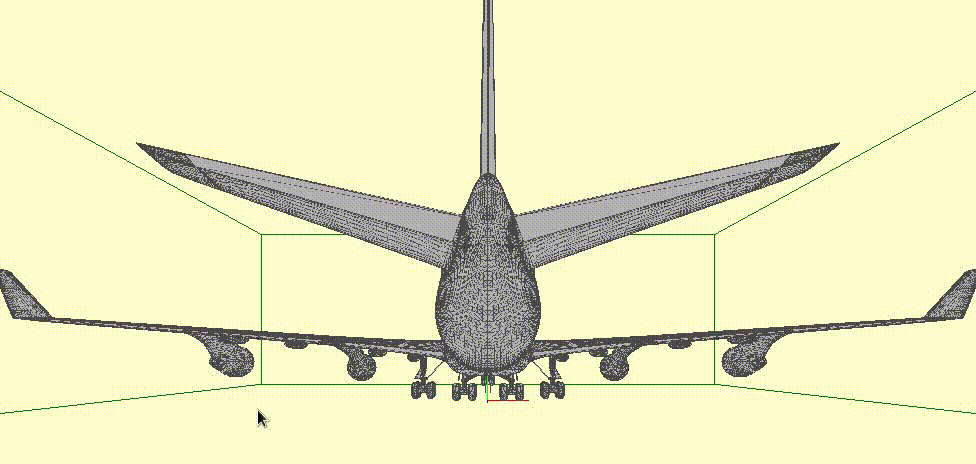
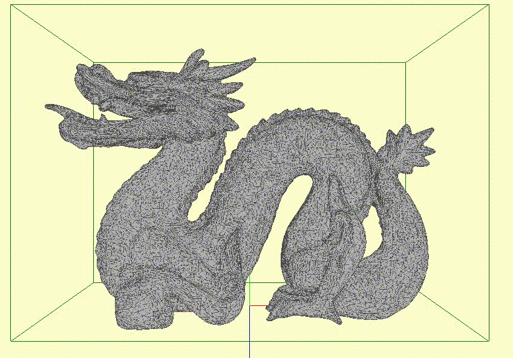

# BVH construction on the GPU 

Algorithm description: [Thinking Parallel, Part III: Tree Construction on the GPU (Karras 2012)](https://developer.nvidia.com/blog/thinking-parallel-part-iii-tree-construction-gpu/)

## Build:

Before building, change the CUDA path in `Makefile` to the actual path on the system.

Then build:

* BVH constructor:
  * `make bvh`

* BVH constructor with visualization:
  * `make bvh_vis`

## Usage:

* `bvh-viz`:
  * `Up`: Go to parent node
  * `Left` `Right`: Descend into left and right child node

## Visualizer screenshot:

`./bvh_vis model=747.obj`

`./bvh_vis model=dragon.obj`

